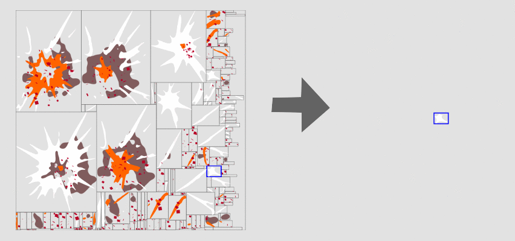

Hygoon Mosaic
=============

A texture packer for stills or animations.  It is an internal tool developed
for [Pterodactyl Attack](http://pteroattack.com), a game made by Hygoon.

We define a "mosaic" as a densely packed texture of variously-sized cells. We
used this to aggressively decrease the footprint of certain animated bitmaps.
For example, you can see how we stored an explosion animation below. The
"mosaic" is on the left and the animation on the right is pieced together from
mosaic cells.

Files
-----

* `islands.py` - identifies contiguous regions of an image
* `recpack.py` - rectangle packer
* `util.py` - packs contiguous regions from multiple images and into a single image

Dependencies
------------

* Python 2.7
* `png` library
* `termcolor` library (for test_recpack.py)

Thanks
------

* [Packing Algorithm](http://www.codeproject.com/Articles/210979/Fast-optimizing-rectangle-packing-algorithm-for-bu)
* [Animation Encoder](https://github.com/sublimehq/anim_encoder) for contiguous region merging strategy
